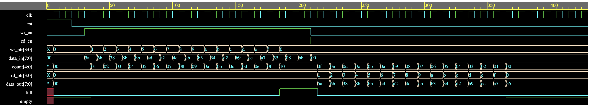
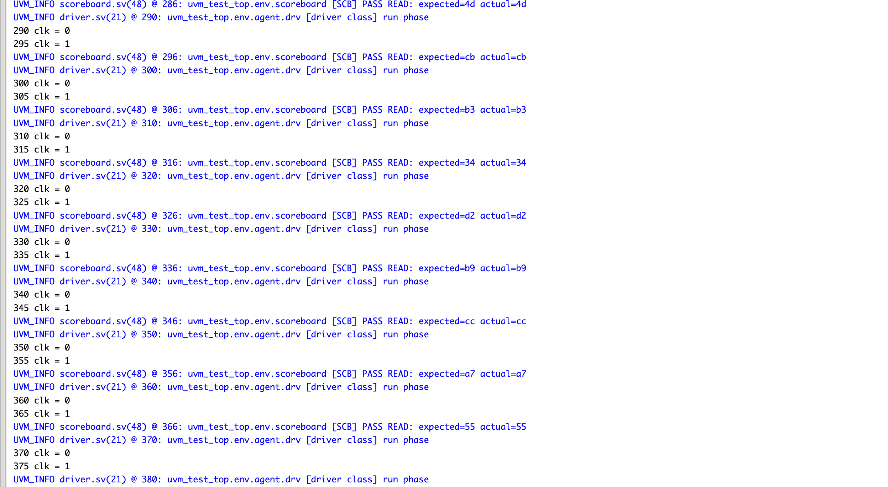
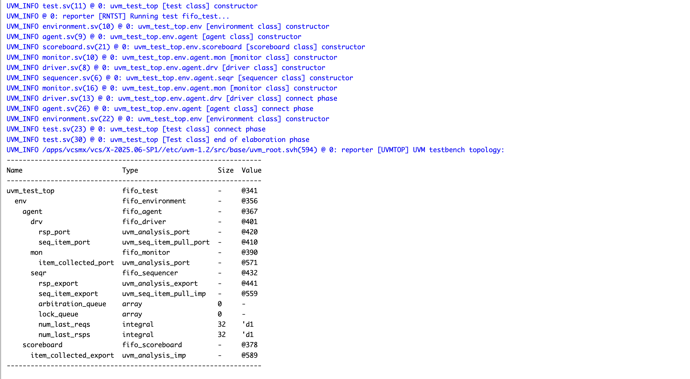
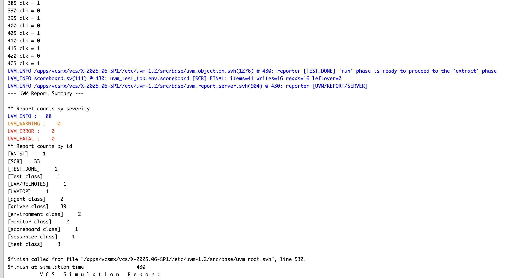

# Synchronous FIFO UVM Verification

This project implements and verifies a parameterized synchronous FIFO using SystemVerilog and UVM 1.2. The verification environment drives FIFO traffic, reconstructs accepted operations in a monitor, and checks read data against a queue-based reference model.

## Highlights

- Parameterized FIFO RTL (`DATA_WIDTH` and `DEPTH`)
- Explicit pointer wrap-around, including non-power-of-two depths
- UVM sequence item, sequences, sequencer, driver, monitor, agent, environment, test, and scoreboard
- Virtual-interface distribution through `uvm_config_db`
- Queue-based, first-in/first-out data checking
- Directed fill and drain sequences with overflow and underflow attempts
- A constrained-random traffic sequence covering write, read, simultaneous, and idle operations
- Eight SystemVerilog assertions for reset, occupancy, pointer, and count behavior
- VCD waveform generation

## Architecture

```text
fifo_test
└── fifo_environment
    ├── fifo_agent
    │   ├── fifo_sequencer
    │   ├── fifo_driver
    │   └── fifo_monitor
    └── fifo_scoreboard

sequence -> sequencer -> driver -> interface -> FIFO DUT
                                              |
scoreboard <- analysis port <- monitor <-------+
```

The driver applies requests on the falling clock edge. The DUT accepts them on the following rising edge. The monitor waits one simulation step for registered read data and status outputs to settle, then publishes the observed transaction to the scoreboard.

## Verification scenarios

The default `fifo_test` runs these sequences in order:

1. `fifo_fill_sequence`: 18 write attempts. With the default depth of 16, the first 16 fill the FIFO and the final two exercise write blocking while full.
2. `fifo_drain_sequence`: 18 read attempts. The first 16 drain the FIFO and the final two exercise read blocking while empty.

`fifo_sequence` is also included as a constrained-random traffic generator. Its weighted distribution produces write-only, read-only, simultaneous read/write, and idle transactions. It is available for additional tests but is not started by the default directed test.

## Scoreboard

The scoreboard uses a SystemVerilog queue as an independent FIFO reference model. It saves `pre_size` before processing each monitored cycle and determines accepted operations only from that model state:

- A write is accepted when `wr_en` is asserted and `pre_size < DEPTH`.
- A read is accepted when `rd_en` is asserted and `pre_size > 0`.
- Accepted writes call `push_back(data_in)`.
- Accepted reads call `pop_front()` and compare the expected value with `data_out` using four-state equality.
- After modeling both operations, DUT `full` and `empty` are compared with the predicted queue occupancy.

The reference model never trusts DUT `full` or `empty` to decide what happened. This prevents a faulty status flag from masking its own bug and correctly checks the boundary write that makes the FIFO full and the boundary read that makes it empty. The scoreboard report summarizes accepted operations and remaining model entries; the directed regression is expected to finish with `writes=16 reads=16 leftover=0`.

## Assertions

The RTL contains assertions checking that:

- `full` and `empty` are not asserted together.
- Occupancy does not exceed `DEPTH`.
- The write pointer remains stable on a write attempt while full.
- The read pointer remains stable on a read attempt while empty.
- A valid write-only operation increments occupancy.
- A valid read-only operation decrements occupancy.
- A simultaneous accepted read/write keeps occupancy stable.
- Reset clears both pointers and occupancy.

Assertions report failures only. The invariant checks are disabled during reset to avoid false failures from startup state.

## Files

| File | Purpose |
| --- | --- |
| `design.sv` | Parameterized FIFO RTL and assertions |
| `interface.sv` | FIFO interface shared with UVM through a virtual interface |
| `seq_item.sv` | FIFO transaction and constrained-random distribution |
| `sequence.sv` | Random, fill, and drain sequences |
| `sequencer.sv` | Typed UVM sequencer |
| `driver.sv` | Falling-edge FIFO stimulus driver |
| `monitor.sv` | Request/status sampling and analysis-port publication |
| `scoreboard.sv` | Queue-based reference model and comparisons |
| `agent.sv` | Active/passive UVM agent |
| `environment.sv` | Agent and scoreboard integration |
| `test.sv` | Default fill-then-drain test |
| `testbench.sv` | Clock, reset, DUT instance, configuration, and waveform dump |

## Running

Use a SystemVerilog simulator with UVM 1.2 support. For Synopsys VCS, one typical invocation is:

```sh
vcs -full64 -sverilog -ntb_opts uvm-1.2 design.sv testbench.sv -o simv
./simv +UVM_TESTNAME=fifo_test
```

On EDA Playground, add `design.sv` as the design and the remaining files as testbench sources, select a UVM-capable simulator, enable UVM 1.2, and run `fifo_test`.

## Captured results

The supplied run demonstrates the UVM hierarchy, independent queue comparisons, FIFO fill/drain boundary behavior, and a clean UVM report summary.

### Fill and drain waveform



The waveform shows reset, all 16 accepted writes, `full` assertion on the boundary cycle, all 16 accepted reads, and `empty` assertion on the final read boundary.

### Queue-based comparisons



### UVM topology



### UVM report summary



The captured fill/drain run completes with 16 accepted writes, 16 accepted reads, and no leftover reference entries. Its UVM report contains zero `UVM_WARNING`, `UVM_ERROR`, and `UVM_FATAL` messages. This is a UVM report summary; it is not a separate assertion-coverage report.

## Scope

This is a learning-focused verification project. Functional coverage, code-coverage reports, formal proof, and a simulator-independent regression script are not included, so the project does not claim those results.
